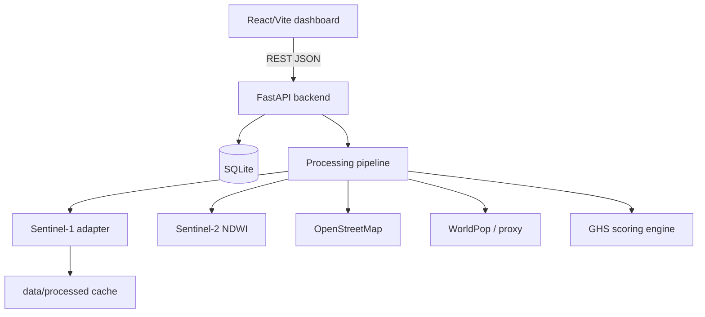

# GoldenHour AI — Disaster Intelligence & Rescue Prioritization

> **Academic/research prototype.** GoldenHour AI converts satellite imagery, GIS data,
> population exposure, road accessibility, and crowdsourced incident reports into a
> continuously updated disaster-response priority map for Chennai, India.

> **Disclaimer:** GoldenHour AI is an academic/research prototype for disaster-response
> prioritization. Its scores are decision-support heuristics and are **not medically
> validated survival predictions**. Satellite observations, population estimates,
> crowdsourced reports, and accessibility estimates may contain errors and should not
> be treated as ground truth. It is not connected to emergency services.

## Features

- **Golden Hour Score (GHS)** — transparent weighted *Disaster Response Priority Score* (0–100) per micro-zone, with per-factor breakdown
- **Sentinel-1 SAR prototype flood detection** (pre/post backscatter change) + **Sentinel-2 NDWI** supporting evidence
- **GeoJSON micro-zone grid** (default 6×6 over Chennai, configurable) served by the backend
- **Leaflet map** (OpenStreetMap, no paid provider): GHS / damage / confidence layers, incident + team markers, silent-zone rings
- **Population exposure (ESTIMATED)** via WorldPop-hook + transparent proxy fallback
- **OSM road accessibility** via Overpass API with graceful demo fallback
- **Crowdsourced reports API** with transparent confidence scoring + duplicate detection
- **Silent-zone detection** (high exposure + ≤2 reports → *Potentially Under-Reported*)
- **Time simulation** (Now / +15 / +30 / +60 min) computed by the backend urgency engine
- **Human override** (escalate/reset, always audit-logged — AI never overrides a human)
- **Rescue-team dispatch**, **analytics**, **data-source status** (DEMO / LIVE DATA / STALE), **audit log**
- **DEMO MODE** (deterministic, reproducible, no credentials) vs **LIVE DATA MODE**

## Architecture



```text
goldenhour-ai/
├── frontend/        # Vite + React + Leaflet + Recharts + Tailwind
│   ├── src/services/api.js   # all backend calls (centralised)
│   ├── src/components/MapView.jsx
│   └── src/lib/demo.js       # deterministic offline fallback (no Math.random)
├── backend/
│   ├── app/main.py           # FastAPI factory
│   ├── app/api/routes.py     # REST endpoints
│   ├── app/scoring/ghs.py    # GHS engine (pure, tested)
│   ├── app/satellite/        # Sentinel + prototype flood detection
│   ├── app/services/         # OSM + population adapters
│   ├── app/gis/zones.py      # grid + GeoJSON
│   ├── app/demo/chennai.py   # deterministic Chennai scenario
│   └── tests/                # pytest suite
├── data/sample/chennai_zones.geojson
├── scripts/demo.py | refresh_live.py
├── docker-compose.yml
└── .env.example
```

## Operating modes (honest status)

| Badge | Meaning |
|---|---|
| **DEMO DATA** (amber) | Deterministic synthetic Chennai scenario. No network needed. |
| **LIVE DATA** (green) | At least one real source (satellite/OSM) retrieved fresh data within `FRESHNESS_MINUTES` (default 180). |
| **STALE DATA** (grey) | Live attempted but the last successful update is older than the freshness window. |
| **DATA UNAVAILABLE** (red) | Retrieval failed and nothing fresh exists. Cached/demo values are kept and labelled, never silently passed off as live. |

`GET /api/status` exposes per-source `last_checked / last_successful_update / acquisition_time / processing_time` plus a `data_version` token. The dashboard polls `/api/status` every 45 s and reloads only when the version changes; a WebSocket (`/ws/updates`) pushes `satellite_updated / zones_updated / report_received / team_dispatched / override_changed` events with polling as fallback (header shows `ws` or `poll`).

## Live satellite pipeline (no credentials required)

```text
Planetary Computer STAC search (S1 RTC + S2 L2A, cloud-filtered)
        ↓  (Copernicus OData catalogue as fallback)
Cache metadata → data/raw/sentinel1|2/*.json
        ↓
Download open preview renders (cached, never re-downloaded)
        ↓
Map study grid cells → pixel windows (linear lon/lat over scene bbox)
        ↓
Per-zone dark-pixel fraction (calm water renders dark in SAR previews)
        ↓
Pre/post change comparison (newest scene vs one ≥20 days older)
        ↓
Fuse S1 (70%) + S2 visual corroboration (30%) → flood_extent,
change_score, satellite_confidence per zone
        ↓
Write zones.severity/flood_extent + zone_metrics + satellite_analysis rows
        ↓
Recalculate GHS → bump data_version → audit + WebSocket broadcast
```

Run it from the UI (**Live Refresh** button, with staged progress in Data Sources →
*Last refresh log*), via `POST /api/analysis/flood`, via `POST
/api/ingest/refresh?mode=live`, or automatically: the backend scheduler checks
for products newer than the last analysis every `SATELLITE_REFRESH_MINUTES`
(default 60) and processes only when something new exists
(`scripts/refresh_live.py` does one manual check).

Label: **Prototype SAR Flood Detection** — a transparent preview-based
prototype, not a calibrated backscatter chain (that needs rasterio/GDAL).
`compute_ndwi()` in `backend/app/satellite/analysis.py` implements the real
NDWI equation on reflectance arrays (unit-tested) for use when calibrated
bands are available; the live preview path honestly uses a *visible-water
proxy* instead, because true-colour previews carry no NIR band.

Try it live (needs internet, no keys):

```bash
curl -X POST http://localhost:8000/api/satellite/search \
  -H "Content-Type: application/json" \
  -d '{"start_date":"2026-08-01","end_date":"2026-09-06","cloud_max":40}'
curl -X POST http://localhost:8000/api/analysis/flood \
  -H "Content-Type: application/json" -d '{"force": true}'
```

## Golden Hour Score

`GHS = 0.24·populationRisk + 0.23·urgency + 0.18·vulnerability + 0.17·severity + 0.11·confidence + 0.07·accessibility`

Classes: **Critical ≥85 · High ≥65 · Medium ≥40 · Low <40**. Weights are configurable via
`GHS_W_*` env vars and visible in the UI (Data Sources tab). Urgency uses illustrative
per-incident decay/rise curves (e.g. trapped-under-rubble decays slowly, rising-water rises
to +45 min) — **not medical estimates**.

## Flood detection (prototype)

```text
pre-event backscatter → post-event backscatter → ΔdB → water classification
→ flood extent → intersect zones → damage score
damage = 0.50·flood_extent + 0.25·change + 0.15·buildings + 0.10·imagery_confidence
```

NDWI `(Green−NIR)/(Green+NIR)` from Sentinel-2 is supporting evidence only.

## Installation

### Option A — local (no Docker)

```bash
# backend
py -m pip install -r backend/requirements.txt
py scripts/demo.py
py -m uvicorn backend.app.main:app --reload --port 8000   # http://localhost:8000/docs

# frontend (new terminal)
cd frontend
npm install
npm run dev   # http://localhost:5173
```

### Option B — Docker

```bash
cp .env.example .env
docker compose up --build
# frontend http://localhost:5173 · backend http://localhost:8000/docs
```

## Demo mode (reproducible, no credentials)

```bash
py scripts/demo.py
```

Loads the deterministic Chennai flood scenario: 36 named neighbourhood zones
(Adyar, Velachery, Tambaram, …), 40 reports, 12 teams. The header shows **DEMO DATA**.
No `random` is used anywhere in demo generation (stable hashes only).

## Live satellite setup

1. Copy `.env.example` → `.env`, keep `APP_MODE=demo` initially.
2. **Sentinel-1/2 (Copernicus Data Space):** register at `dataspace.copernicus.eu`,
   set `COPERNICUS_USERNAME` / `COPERNICUS_PASSWORD`, then in the UI press
   **Live Refresh** (or `POST /api/ingest/refresh?mode=live`, or `py scripts/refresh_live.py`).
3. **Google Earth Engine (optional):** install `earthengine-api`, authenticate a
   service account, set `EARTH_ENGINE_ENABLED=true`, `GEE_PROJECT`, and
   `GOOGLE_APPLICATION_CREDENTIALS`. Status is shown under Data Sources; the app
   always works with it disabled.
4. **OSM** needs no key (Overpass API). **WorldPop:** drop a raster at `WORLDPOP_TIF`
   to enable the raster hook; otherwise the transparent ESTIMATED proxy is used.
5. On success the header switches to **LIVE DATA**; stale/failed sources show
   **STALE DATA** / `unavailable` / `Data temporarily unavailable` instead of crashing.

## API

| Method | Path | Description |
|---|---|---|
| GET | `/api/status` | freshness truth + data version |
| POST | `/api/satellite/search` | real STAC/Copernicus search (bbox, dates, cloud_max) |
| POST | `/api/analysis/flood` | live flood pipeline (staged steps log) |
| GET | `/api/satellite/products` | cached products + past analyses |
| GET | `/api/satellite/preview/{product_id}` | cached real preview PNG |
| POST | `/api/reports/{id}/verify` | human verification (only path to *Human Verified*) |
| GET | `/api/study-areas` | active area + presets (Chennai, Mumbai, …) |
| POST | `/api/study-areas/{name}/activate` | switch study area |
| WS | `/ws/updates` | live event push (polling fallback) |
| GET | `/api/health` | status, mode, counts |
| GET | `/api/config` | study area, weights, profiles |
| GET | `/api/zones?t_min=` | scored zones |
| GET | `/api/zones/geojson?mode=&t_min=` | GeoJSON (`priority`/`damage`/`confidence`) |
| GET | `/api/zones/projections` | Now/+15/+30/+60 per zone |
| GET | `/api/zones/{id}` | zone detail + flood analysis |
| POST | `/api/zones/{id}/override` | human escalate/reset |
| GET/POST | `/api/reports` | list / submit crowdsourced report |
| GET | `/api/teams` | rescue teams |
| POST | `/api/teams/{id}/dispatch` | dispatch (auto top-priority or explicit zone) |
| GET | `/api/analytics` | distributions, exposure, silent zones |
| GET | `/api/data-sources` | source statuses + GEE |
| GET | `/api/audit` | audit log |
| POST | `/api/ingest/refresh?mode=` | demo rebuild / live refresh |

## Hosting (GitHub + Vercel + Render)

GitHub and Vercel do different jobs — use all three (all free):

| Piece | Where | Why |
|---|---|---|
| Code | **GitHub** repo | version control; Vercel/Render deploy from it |
| Dashboard (React) | **Vercel**, Root Directory `frontend` | free, fast CDN, auto-deploys on push |
| API (FastAPI) | **Render** via `render.yaml` | Vercel is serverless (stateless) — a bad fit for SQLite, the disk cache, WebSockets and the satellite scheduler, which this backend uses |

### 1. Push to GitHub

```bash
cd "C:\Users\sanjay\Documents\Disater management"
git init
git add .
git commit -m "GoldenHour AI - disaster intelligence prototype"
git branch -M main
git remote add origin https://github.com/<you>/goldenhour-ai.git
git push -u origin main
```

(`node_modules/`, `dist/`, `*.db`, `.env` are already git-ignored.)

### 2. Backend on Render

1. Go to **render.com → New → Blueprint** and point it at your repo (uses `render.yaml`).
2. Wait for deploy; note the URL, e.g. `https://goldenhour-ai-backend.onrender.com`.
3. Check `https://<that-url>/api/health` returns `{"status":"ok",...}`.
4. Notes: free instances sleep after inactivity (first load takes ~1 min);
   disk is ephemeral, so the DB reseeds the demo on restart (by design);
   the scheduler is off on free tier — use the dashboard's **Live Refresh**.

### 3. Frontend on Vercel

1. Go to **vercel.com → Add New → Project → Import** the same repo.
2. Set **Root Directory** to `frontend` (Framework Preset: Vite).
3. Add environment variable: `VITE_API_URL=https://goldenhour-ai-backend.onrender.com`
4. Deploy. The dashboard URL (e.g. `https://goldenhour-ai.vercel.app`) is shareable.

### Alternative single-host path

`docker-compose.yml` + both Dockerfiles deploy frontend + backend anywhere
that runs containers (Render, Railway, Fly.io, a college VM).

## Testing

```bash
py -m pytest backend/tests -q   # 36 tests: GHS, classification, urgency,
                                # silent zones, algorithmic confidence (+custom
                                # thresholds), human verification, duplicates,
                                # STAC parsing, NDWI, SAR thresholding, zone
                                # intersection, GeoJSON, API, overrides, dispatch
                                # (+1 opt-in live-network test: GH_LIVE_TEST=1)
```

## Known limitations

- Flood detection is a preview-based threshold prototype (needs rasterio/GDAL +
  calibrated backscatter for production-grade mapping); NDWI runs on real arrays
  only when calibrated bands are supplied.
- Population figures are ESTIMATED proxies unless a WorldPop raster is configured.
- OSM accessibility is a road-density/flood proxy, not live traffic/closure data.
- Report confidence is algorithmic (never fact-checked); only explicit human action
  yields *Human Verified*.
- Single SQLite file; 45 s status polling + optional WebSocket — fine for a college prototype.
